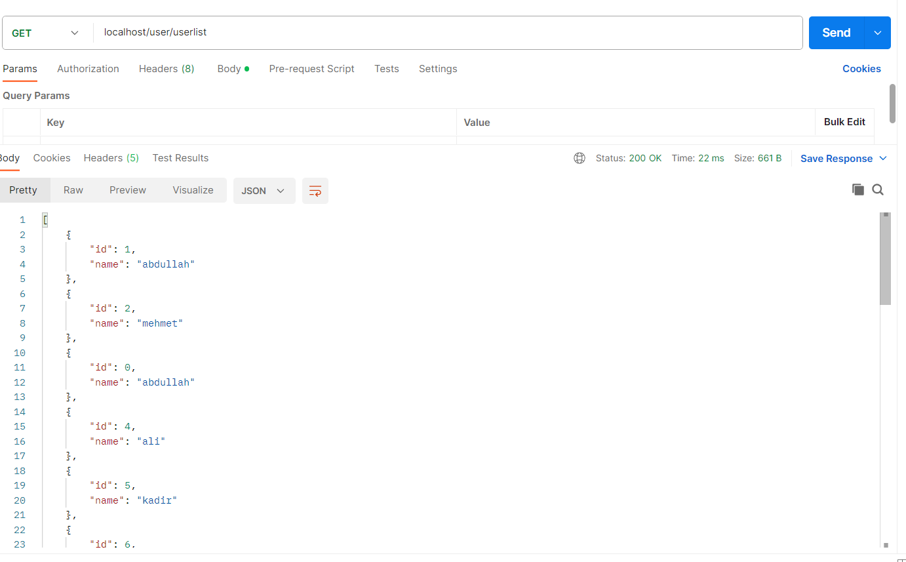
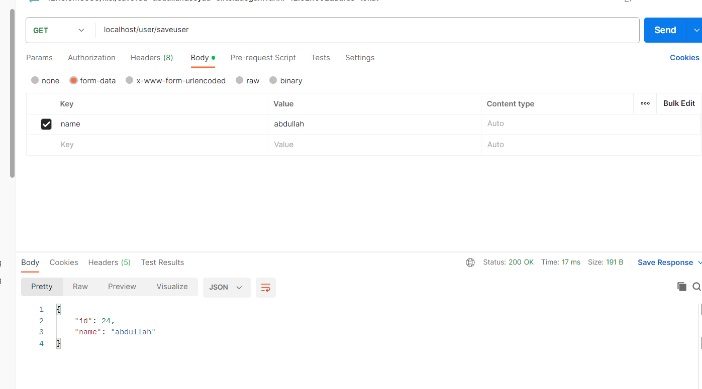

<p align="center">
  <a href="" rel="noopener">
 
 </a>
</p>

<h3 align="center">Spring Framework Mongo Rest Api</h3>

<div align="center">

[](/LICENSE)

</div>

---

## 🧐Proje Hakkında <a name = "about"></a>

Spring framework ile basit bir rest api yaptık

## 🏁 Başlangıç <a name = "getting_started"></a>

### Kurulum için gerekenler
- <a href="https://www.docker.com/products/docker-desktop/">Docker</a>  

### Kurulum

```
git clone https://github.com/abdullahciftci034/springboot_mongo_rest_api.git
```
```
cd springboot_mongo_rest_api
```
```
docker-compose build 
```
```
docker-compose up
```

### 📝İçerik

- [docker](#docker)
- [mongo](#mongo)
- [spring](#spring)

### Preview


